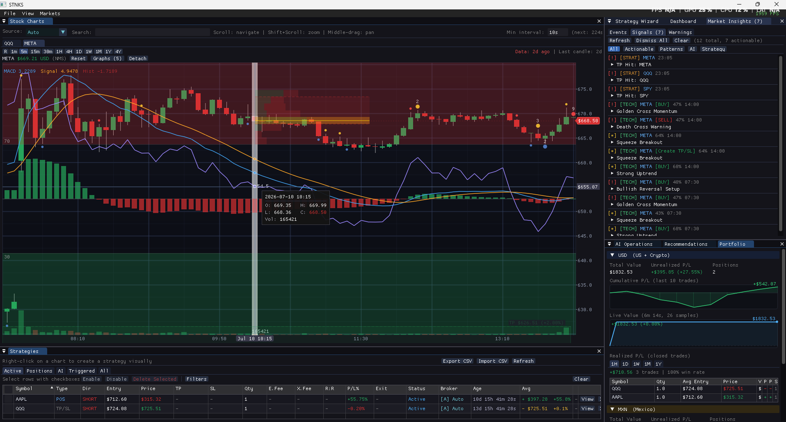

# STNKS

A real-time finance tool for strategy management, market visualization, and trade execution. Built with C++17, SDL2, OpenGL 3.3, and Dear ImGui.



## Table of Contents

- [Installation](#installation)
- [Usage](#usage)
  - [Client (GUI)](#client-gui)
  - [Server (Headless)](#server-headless)
- [Code Topics](#code-topics)
  - [UI System](#ui-system)
  - [Threading](#threading)
  - [Async Patterns](#async-patterns)
  - [IO: HTTP](#io-http)
  - [IO: WebSockets](#io-websockets)
  - [IO: ENet (UDP Market Feed)](#io-enet-udp-market-feed)
  - [IO: REST API Server](#io-rest-api-server)
  - [Broker Connectors](#broker-connectors)
- [Environment Variables](#environment-variables)
- [Project Structure](#project-structure)

---

## Installation

### Platform Support

| Platform | GUI Client | Headless Server | Compiler |
|----------|-----------|----------------|----------|
| **Windows** | Yes | Yes | MSVC 2019+ |
| **Linux (x86_64)** | Yes | Yes | GCC 8+ / Clang 7+ |
| **Linux (ARM / Raspberry Pi)** | No | Yes | GCC 8+ |
| **macOS** | Untested | Untested | Apple Clang |

The GUI client requires SDL2 + OpenGL 3.3. ARM devices like the Raspberry Pi 3 don't support OpenGL 3.3, so only the headless server works there.

**Typical deployment**: GUI client on Windows/Linux desktop, headless server on Raspberry Pi or cloud VM for 24/7 monitoring.

> You need **both** MSVC and GCC if you develop on Windows and deploy the server to Linux. The codebase targets C++17 and compiles on both. See [C++ Compatibility Note](#c-compatibility-note).

### Prerequisites

- **CMake** >= 3.20
- **C++17 compiler** -- MSVC (Windows) or GCC 8+ (Linux)
- **vcpkg** -- C++ package manager
- **Git**

### 1. Dev Environment Setup

```bash
# Linux/macOS
./dev_env/setup-dev.sh

# Windows
dev_env\setup-dev.bat
```

This checks prerequisites (cmake, git) and bootstraps vcpkg if `VCPKG_ROOT` is not set.

### 2. Build

```bash
# Linux/macOS
./dev_env/build.sh              # GUI client (default)
./dev_env/build.sh --server     # Headless server
./dev_env/build.sh --tests      # Tests
./dev_env/build.sh --all        # Everything
./dev_env/build.sh --release    # Release mode
./dev_env/build.sh --clean      # Clean + reconfigure

# Windows
dev_env\build.bat               # Same flags apply
```

Produces:
- `src/build/Entry/Entry` (or `.exe`) -- GUI client
- `src/build/Server/stnks-server` (or `.exe`) -- headless server

The `--server` flag sets `STNKS_HEADLESS=ON`, which excludes UI/Charts/ImGui from STNKS_CORE and skips Entry/Tests.

### 3. Environment Setup

Copy the template, fill in your keys, then source it:

```bash
# Linux/macOS
cp dev_env/setup_env.sh .env.sh
# edit .env.sh with your API keys
source .env.sh

# Windows
copy dev_env\setup_env.bat .env.bat
# edit .env.bat with your API keys
.env.bat
```

At minimum set `ASSETS_STNKS` to the project root. All broker keys are optional -- without them the app uses Yahoo Finance as a free fallback (~15min delayed prices).

### 4. First Run (Database)

The database is created automatically on first run. Migrations in `db/migrations/` are applied by `MigrationRunner` at startup. To manually seed a database:

```bash
./dev_env/seed_db.sh                        # default: app/strategies.db
./dev_env/seed_db.sh path/to/my.db          # custom path
./dev_env/seed_db.sh path/to/my.db --no-seed  # skip sample data
```

### C++ Compatibility Note

The codebase must compile on both MSVC and GCC:
- **Never use `= {}` as a default argument** for struct/class references with member initializers. GCC rejects it. Use delegating constructors instead.
- Target **C++17** (`std::optional`, `std::filesystem`, structured bindings, `if constexpr`).
- GCC < 9 needs explicit `-lstdc++fs` for `std::filesystem` (handled in CMake).

### Dependencies (vcpkg)

All dependencies are in `src/vcpkg.json` and install automatically:

| Library | Purpose |
|---------|---------|
| spdlog | Logging |
| cereal | Serialization |
| nlohmann-json | JSON parsing |
| cpr | HTTP client (libcurl wrapper) |
| sqlite3 | Strategy database |
| cpp-httplib | Embedded HTTP server |
| enet | UDP networking (market feed) |
| ixwebsocket | WebSocket client (broker streams) |
| openssl | TLS for HTTPS / WSS |
| sdl2 | Window + OpenGL context *(GUI only)* |
| glew | OpenGL extension loading *(GUI only)* |
| glm | Math library *(GUI only)* |
| stb | Image loading *(GUI only)* |
| gtest | Unit tests *(GUI only)* |

---

## Usage

### Client (GUI)

```bash
source .env.sh

# Monolith mode (default -- embedded server, no separate process)
./build/Entry/Entry

# Remote mode (connect to a running stnks-server)
export STNKS_SERVER_URL="http://your-server:8099"
./build/Entry/Entry
```

**Monolith mode**: Embeds `LocalStrategyService` with a background-thread strategy server and direct SQLite connection.

**Remote mode**: Connects to a headless server via REST (HTTP) for strategy CRUD and ENet (UDP) for real-time ticks.

#### Key Features

- **Stock Charts** -- Candlestick + Volume/RSI/MACD sub-panels. Scroll=pan, Shift+Scroll=zoom, Ctrl+Scroll=Y-pan
- **Strategy Table** -- Excel-like inline editing, multi-select, CSV import/export
- **Strategy Wizard** -- Right-click chart to create. Gizmos and wizard sync bidirectionally
- **Detachable Charts** -- Tear out into independent dockable windows with own search + auto-refresh
- **Real-time ("R" timeframe)** -- Polls broker/Yahoo for live prices, animates last candle
- **Dashboard** -- Connection status, latency, telemetry. Docked with Graph Events + Market Signals
- **AI Analysis** -- Claude-powered analysis with configurable prompts (`config/prompts/`)
- **Market Signals** -- Unified signals from patterns, AI, and strategy triggers
- **Toast Notifications** -- Stacked top-left popups for errors, warnings, confirmations

### Server (Headless)

Monitors strategies, executes trades, serves REST API + ENet feed. Runs on Linux (including ARM) for 24/7 operation.

```bash
# Basic
source .env.sh
./build/Server/stnks-server

# With options
./build/Server/stnks-server \
  --port 8099 \
  --interval 60 \
  --sentiment-interval 600 \
  --gnews-key $GNEWS_API_KEY \
  --claude-key $CLAUDE_API_KEY \
  --db strategies.db \
  --log app/stnks-server.log

# Then on your desktop
export STNKS_SERVER_URL="http://raspberrypi.local:8099"
./build/Entry/Entry
```

#### Server CLI Options

```
--port <port>               HTTP API port (default: 8099)
--host <host>               HTTP API bind address (default: 0.0.0.0)
--interval <sec>            Price polling interval (default: 60)
--sentiment-interval <sec>  AI sentiment interval (default: 600)
--broker-url <url>          Broker API base URL
--api-key <key>             Broker API key (omit for dry-run)
--account <id>              Broker account ID
--gnews-key <key>           GNews API key (default: $GNEWS_API_KEY)
--claude-key <key>          Claude API key (default: $CLAUDE_API_KEY)
--db <name>                 SQLite database file (default: strategies.db)
--log <path>                Log file path (default: app/stnks-server.log)
```

#### REST API

```
GET    /api/strategies                                   List all
GET    /api/strategies/active                            List active
GET    /api/strategies/:id                               Get by ID
GET    /api/strategies/symbol/:sym                       Get by symbol
POST   /api/strategies                                   Create (JSON body)
PUT    /api/strategies/:id                               Update (JSON body)
DELETE /api/strategies/:id                               Delete
POST   /api/strategies/:id/cancel                        Cancel
GET    /api/market/quote?symbol=X&interval=1d&range=6mo  Fetch quote
GET    /api/market/search?q=X                            Search symbols
GET    /api/status                                       Server health
```

Example:

```bash
curl -X POST http://localhost:8099/api/strategies \
  -H "Content-Type: application/json" \
  -d '{"symbol":"AAPL","direction":0,"entryPrice":150.0,"takeProfit":160.0,"stopLoss":145.0}'
```

---

## Code Topics

### UI System

Built on **SDL2 + OpenGL 3.3 + Dear ImGui** with a dockable window layout.

`SDL2App` owns the window and GL context, runs the main loop, calls `ExecutionPipeline::UpdateUI()` each frame. The `UI` class is the primary pipeline.

```cpp
// src/Entry/src/main.cpp
int main(int argc, char* argv[])
{
    auto app    = std::make_shared<SDL2App>(COMPILED_EXEC_NAME);
    auto engine = std::make_shared<Engine>(app);

    auto ui = std::make_shared<UI>(engine);
    app->AddExecutionPipeline(ui);

    app->Init(argc, argv);
    return app->Exec();
}
```

**Panel pattern**: Each panel takes a `UIContext&` (non-owning pointers to shared state) and draws into its own `ImGui::Begin/End` window.

```cpp
// src/Core/include/UI/DashboardPanel.hpp
class DashboardPanel
{
public:
    explicit DashboardPanel(UIContext& ctx) : ctx_(ctx) {}
    void Draw(bool* open);
private:
    UIContext& ctx_;
};
```

**Chart layer system**: `StockChart` is a stack of `ChartLayer` subclasses. Layers can be sub-panels (`height > 0`) or overlays (`height = 0`).

```
StockChart
  |-- CandlestickLayer (height=0, fills main area)
  |-- VolumeLayer      (height=120, sub-panel)
  |-- RSILayer         (height=100, sub-panel)
  |-- MACDLayer        (height=100, sub-panel, togglable)
  +-- StrategyLayer    (overlay, draws TP/SL/entry gizmos)
```

**Strategy Wizard + Gizmo flow**: Right-click chart -> `StrategyLayer::onCreateRequested` -> wizard opens as dockable panel. Gizmos and wizard share the same `Strategy` object and sync bidirectionally.

### Threading

All concurrency goes through `ThreadRegistry`, which owns a thread pool and named worker threads.

```cpp
// src/Core/include/Threading/ThreadRegistry.hpp
class ThreadRegistry
{
public:
    explicit ThreadRegistry(size_t poolSize = 0);  // default: hardware_concurrency - 2

    WorkerThread& CreateWorker(const std::string& name);  // Named persistent loop
    WorkerThread*  GetWorker(const std::string& name);

    template <class F, class... Args>
    auto Submit(F&& f, Args&&... args);   // Returns std::future<T>

    template <typename Fn>
    void ParallelFor(size_t count, Fn&& fn, size_t minPerThread = 64);

    std::vector<ThreadInfo> GetStatus() const;
    void Shutdown();
};
```

**ThreadPool**: `std::condition_variable` + `std::queue<std::function<void()>>`. Workers sleep until notified. `Submit()` wraps it:

```cpp
auto future = threads.Submit([&http, url]() {
    return http.Get(url);
});
HttpResponse resp = future.get();
```

**WorkerThread**: Named persistent thread running a function in a tight loop. Lifecycle: `Idle -> Running -> Stopping -> Stopped`. Used for real-time price polling, ENet network loops, broker WebSocket pumps.

```cpp
// src/Core/include/Threading/WorkerThread.hpp
auto& worker = threads.CreateWorker("price-poll");
worker.Start([this]() {
    float price = broker->FetchCurrentPrice(symbol);
    UpdatePriceCache(symbol, price);
    std::this_thread::sleep_for(std::chrono::milliseconds(500));
});
// worker.GetLastDurationMs()   -- profiling
// worker.GetIterationCount()   -- telemetry
// worker.Stop()                -- join + cleanup
```

### Async Patterns

The UI thread never blocks on I/O. Background work (HTTP fetches, broker streams, chart scanning) uses these patterns:

#### 1. MPSC Drain (Multiple Producer, Single Consumer)

Multiple pool threads push results into a mutex-guarded vector. The main thread drains once per frame.

```
  Pool Thread A --push--+
  Pool Thread B --push--+--> [mutex-guarded vector] --drain--> UI Thread (each frame)
  Pool Thread C --push--+
```

```cpp
// src/Core/include/Market/MarketService.hpp
class MarketService {
    std::mutex                    quotesMutex_;
    std::vector<QuoteFetchResult> pendingQuotes_;

    void FetchQuoteAsync(const std::string& symbol, ...);

    template <typename Fn>
    size_t DrainQuoteResults(Fn&& fn)
    {
        std::lock_guard<std::mutex> lock(quotesMutex_);
        size_t count = pendingQuotes_.size();
        for (auto& r : pendingQuotes_)
            fn(std::move(r));
        pendingQuotes_.clear();
        return count;
    }
};
```

Used by `MarketService::DrainQuoteResults()` (chart data) and `DrainSearchResults()` (symbol search). Same shape: `FetchXAsync()` submits to pool, producer pushes under lock, `DrainX()` sweeps per frame.

#### 2. Lock-Free SPSC Ring Buffer

For single-producer/single-consumer with zero contention. Uses `std::atomic` head/tail with `acquire/release` ordering and `alignas(64)` to prevent false sharing.

```cpp
// src/Core/include/Threading/AsyncQueue.hpp
template <typename T, size_t Capacity>  // Capacity must be power of two
class AsyncQueue
{
    bool TryPush(T&& item);              // false if full (back-pressure)
    std::optional<T> TryPop();           // nullopt if empty
    size_t DrainInto(Fn&& fn);           // Pop all into callback
    size_t ApproxSize() const;           // Non-blocking

    std::array<T, Capacity>         buffer_{};
    alignas(64) std::atomic<size_t> head_{0};
    alignas(64) std::atomic<size_t> tail_{0};
};
```

No mutex, no syscall, no cache-line contention. Suitable for dedicated network thread -> main thread pipelines.

#### 3. Atomic Price Cache (Lock-Free Reads)

Real-time prices must be readable every frame without locking. `std::atomic<float>` lets the UI read at 60+ FPS while background threads update.

```cpp
// src/Core/include/Market/MarketService.hpp
struct PriceCacheEntry
{
    std::atomic<float>   price{0.f};
    std::atomic<int64_t> timestamp{0};
};

// Background thread (500ms-2s):
entry->price.store(price, std::memory_order_release);

// UI thread (every frame):
float p = entry->price.load(std::memory_order_acquire);
```

A `std::mutex cacheMutex_` protects only the **map structure** (adding new symbols). Once a `PriceCacheEntry*` exists, all reads/writes are lock-free.

Used by: `MarketService::GetCachedPrice()`, `MarketFeedClient::latestTicks_`, broker `ticksReceived_` counters.

#### 4. Callback Dispatch (Network Thread -> Main Thread)

Broker connectors and ENet receive data on network threads and fire registered callbacks. The handler must be thread-safe (update atomics or push to a queue).

```cpp
// src/Core/include/Broker/IBrokerConnector.hpp
virtual void SetOnTick(OnTickCallback cb) = 0;
virtual void SetOnOrder(OnOrderCallback cb) = 0;

// Wiring:
binance->SetOnTick([this](const BrokerTick& tick) {
    // Fires on WebSocket thread -- update atomic, don't touch ImGui
    marketService->UpdatePriceCache(tick.symbol, tick.price);
});

feedClient.SetTickCallback([this](const MarketTick& tick) {
    // Fires on ENet network thread
    latestPrices_[tick.symbol].store(tick.price);
});
```

#### 5. Mutex-Guarded Shared State

For infrequently-written data read from the UI thread. Used by event/signal services.

```cpp
// src/Core/include/Events/GraphEventService.hpp
class GraphEventService {
    mutable std::mutex mutex_;
    std::unordered_map<std::string, std::vector<GraphEvent>> events_;

    void Scan(const std::string& symbol, const StockQuote& quote) {
        std::lock_guard<std::mutex> lock(mutex_);
        // detect and store events
    }

    std::vector<GraphEvent> GetAllEvents() const {
        std::lock_guard<std::mutex> lock(mutex_);
        // copy and return
    }
};
```

#### Pattern Summary

| Pattern | Contention | Use Case | Example |
|---------|-----------|----------|---------|
| **MPSC Drain** | Low (lock per batch) | N pool threads -> 1 UI thread | `MarketService::DrainQuoteResults` |
| **SPSC Ring Buffer** | None (lock-free) | 1 network thread -> 1 UI thread | `AsyncQueue<T, 64>` |
| **Atomic Cache** | None (lock-free) | Frequent reads, rare writes | `PriceCacheEntry::price` |
| **Callback Dispatch** | Minimal | WS/ENet -> price cache | `IBrokerConnector::SetOnTick` |
| **Mutex Shared State** | Low | Background scan -> UI read | `GraphEventService::mutex_` |

All patterns follow the same principle: **background threads produce, UI thread consumes**.

### IO: HTTP

`HttpClient` wraps [cpr](https://github.com/libcpr/cpr) (libcurl):

```cpp
// src/Core/include/Http/HttpClient.hpp
class HttpClient
{
public:
    explicit HttpClient(ThreadRegistry& threads);

    HttpResponse Get(const std::string& url, const Headers& headers = {});
    HttpResponse Post(const std::string& url, const std::string& body, const Headers& headers = {});
    HttpResponse Put(const std::string& url, const std::string& body, const Headers& headers = {});
    HttpResponse Delete(const std::string& url, const Headers& headers = {});

    std::future<HttpResponse> GetAsync(const std::string& url);
};
```

```cpp
HttpResponse resp = http.Get("https://api.example.com/data");
if (resp.Ok()) {
    auto json = nlohmann::json::parse(resp.body);
}
```

Market data uses the MPSC pattern:

```cpp
marketService->FetchQuoteAsync("AAPL", "1d", "6mo");

// UI thread, each frame:
marketService->DrainQuoteResults([](QuoteFetchResult&& r) {
    // update chart
});
```

### IO: WebSockets

`IWebSocketClient` interface with `WebSocketClient` implementation (ixwebsocket). Used by broker connectors for real-time streams.

```cpp
// src/Core/include/Net/IWebSocketClient.hpp
class IWebSocketClient
{
public:
    virtual void Connect(const WsConfig& config) = 0;
    virtual void Disconnect() = 0;
    virtual WsState GetState() const = 0;
    virtual void SendText(const std::string& message) = 0;
    virtual void SendBinary(const std::string& data) = 0;
    virtual void SetOnMessage(MessageCallback cb) = 0;
    virtual void SetOnStateChange(StateCallback cb) = 0;
    virtual void SetOnError(ErrorCallback cb) = 0;
};
```

```cpp
// Binance price stream example
WebSocketClient ws;
ws.SetOnMessage([this](const std::string& data, WsMessageType) {
    auto json = nlohmann::json::parse(data);
    float price = std::stof(json["p"].get<std::string>());
    UpdatePriceCache(json["s"], price);
});

WsConfig config;
config.url = "wss://stream.binance.com:9443/ws/btcusdt@trade";
config.autoReconnect = true;
ws.Connect(config);
```

Features: TLS/SSL, auto-reconnect with exponential backoff, per-message deflate, ping/pong. Thread-safe `Send` -- callbacks fire on the network thread.

### IO: ENet (UDP Market Feed)

[ENet](http://enet.bespin.org/) for real-time tick broadcasting over UDP between server and GUI clients.

**Protocol** -- two channels:
- **Channel 0 (Unreliable)**: Market ticks -- `NetTickPacket` (binary header + symbol + OHLCV)
- **Channel 1 (Reliable)**: Heartbeat -- `NetHeartbeatPacket`

```cpp
// Server side
apiServer.BroadcastTick(symbol, close, open, high, low, volume, timestamp);

server.SetIdleCallback([&apiServer]() {
    apiServer.GetFeedServer().Poll();
});

// Client side
feedClient.SetTickCallback([this](const MarketTick& tick) {
    latestPrices_[tick.symbol] = tick.close;
});
float price = GetCurrentPrice("AAPL");  // prefers ENet live price
```

Server polls at 100ms. Client heartbeats every 1s. States: `Offline -> Connecting -> Connected / Disconnected`.

### IO: REST API Server

Embedded HTTP server via [cpp-httplib](https://github.com/yhirose/cpp-httplib), runs in its own thread.

```cpp
// src/Core/include/Server/HttpApiServer.hpp
class HttpApiServer
{
public:
    HttpApiServer(StrategyStore& store, MarketService& market,
                  StrategyServer* server, const Config& config);
    void Start();
    void Stop();
    void BroadcastTick(const std::string& symbol, float close, float open,
                       float high, float low, float volume, int64_t timestamp);
};
```

### Broker Connectors

Brokers implement `IBrokerConnector`, extending `IBrokerDataSource` (plugs into `MarketService`) with order management.

```cpp
// src/Core/include/Broker/IBrokerConnector.hpp
class IBrokerConnector : public IBrokerDataSource
{
public:
    virtual BrokerOrder PlaceOrder(const std::string& symbol, OrderSide side,
                                   OrderType type, float qty, float price = 0.f) = 0;
    virtual bool CancelOrder(const std::string& orderId) = 0;
    virtual std::vector<BrokerOrder> GetOpenOrders() = 0;
    virtual std::vector<BrokerPosition> GetPositions() = 0;
    virtual BrokerBalance GetBalance() = 0;
    virtual void SetOnTick(TickCallback cb) = 0;
    virtual void SetOnOrderUpdate(OrderCallback cb) = 0;
};
```

| Broker | Market | Auth | Real-time |
|--------|--------|------|-----------|
| **Binance** | Crypto | HMAC-SHA256 | WebSocket (trades + user data stream) |
| **GBM+** | Mexican stocks (BMV) | OAuth2 | WebSocket + Webhooks |
| **MetaTrader 5** | Forex/CFDs | MetaApi bridge | WebSocket |
| **Yahoo Finance** | Global (fallback) | None | Polling (~15min delay) |

**Trade execution flow**:

```
User action / AI signal / TP-SL trigger
  -> ExecuteOrder(symbol, broker, side, qty, price)
    -> Resolve BrokerSource -> IBrokerConnector
    -> connector->PlaceOrder(...)
    -> Toast notification (success / failure / dry-run)
```

When `liveTradingEnabled` is OFF, all orders run in **dry-run mode** (logged, not sent).

---

## Environment Variables

Copy the template and fill in your keys (see [Environment Setup](#3-environment-setup)):

```bash
# Core
ASSETS_STNKS=""              # Root for config/app dirs (default: cwd)
STNKS_SERVER_URL=""          # Set for remote mode (e.g. http://localhost:8099)

# AI & News
CLAUDE_API_KEY=""            # Anthropic API key
GNEWS_API_KEY=""             # GNews API key

# Binance (Crypto)
BINANCE_API_KEY=""
BINANCE_API_SECRET=""
BINANCE_SANDBOX="1"          # 1=testnet, 0=production

# GBM+ (Mexican stocks)
GBM_CLIENT_ID=""
GBM_CLIENT_SECRET=""
GBM_REFRESH_TOKEN=""
GBM_ACCOUNT_ID=""
GBM_SANDBOX="1"              # 1=sandbox, 0=production
GBM_WEBHOOK_SECRET=""
GBM_WEBHOOK_PORT="0"         # 0=disabled

# MetaTrader 5 (via MetaApi)
MT5_API_KEY=""
MT5_ACCOUNT_ID=""
MT5_SERVER="MetaQuotes-Demo"
MT5_LOGIN=""
MT5_PASSWORD=""
```

Only `VCPKG_ROOT` (build time) and optionally `ASSETS_STNKS` (runtime) are needed. Everything else is optional -- without broker keys the app uses Yahoo Finance (~15min delayed).

---

## Project Structure

```
src/
  CMakeLists.txt              # Top-level: STNKS_HEADLESS option, subdirectories
  vcpkg.json                  # Dependency manifest (vcpkg manifest mode)
  Core/
    CMakeLists.txt            # STNKS_CORE static library
    include/
      AI/                     # Claude analyzer, prompt templates
      App/                    # SDL2App, ExecutionPipeline
      Broker/                 # IBrokerConnector, Binance/GBM/MT5 impls
      Charts/                 # ChartLayer stack, StockChart, DetachedChart
      Db/                     # DbStore (template ORM), MigrationRunner, Database
      Events/                 # GraphEvent, GraphEventService
      Http/                   # HttpClient (cpr wrapper)
      Market/                 # MarketService, IMarketSource, MarketHours
      Net/                    # IWebSocketClient, WebSocketClient, ENet feed
      Server/                 # HttpApiServer, StrategyServer, IStrategyAction
      Service/                # IStrategyService, Local/RemoteStrategyService
      Signals/                # MarketSignalService
      Strategy/               # Strategy model, StrategyStore (SQLite)
      Threading/              # ThreadPool, ThreadRegistry, AsyncQueue, WorkerThread
      UI/                     # UI panels, UIContext, UIConstants
    src/                      # Implementation files (mirrors include/ layout)
    external/imgui/           # Vendored Dear ImGui
  Entry/                      # GUI executable entry point
  Server/                     # Headless server executable (stnks-server)
  Tests/                      # Unit tests (gtest)
config/
  prompts/                    # AI prompt templates (analysis.txt, etc.)
dev_env/
  build.sh / build.bat        # Universal build script (--server/--tests/--all/--release/--clean)
  setup-dev.sh / setup-dev.bat # One-time dev env setup (vcpkg bootstrap)
  setup_env.sh / setup_env.bat # Environment variable templates
  seed_db.sh                  # Apply migrations + seeds to a SQLite database
  configure-server.sh         # Legacy: one-time CMake configure for headless server
  build-server.sh             # Legacy: build headless server binary
db/
  migrations/                 # Versioned SQL migrations (001_create_strategies.sql, ...)
  seeds/                      # Sample seed data
app/                          # Runtime data dir (strategies.db, logs) -- created at runtime
```
## Generic/Reusable Components

These modules are domain-agnostic and can be extracted for use in non-finance projects:

### DbStore (Template ORM)

Schema-driven CRUD for any struct mapped to SQLite. Define the schema once, get INSERT/UPDATE/DELETE/SELECT/CREATE TABLE for free.

```cpp
#include <Db/DbStore.hpp>

struct Todo {
    int64_t     id = 0;
    std::string title;
    bool        done = false;
    int64_t     createdAt = 0;
};

inline const auto kTodoSchema = db::MakeSchema<Todo>(
    "todos", &Todo::id,
    db::Col("title",      &Todo::title,     "TEXT",    "NOT NULL"),
    db::Col("done",       &Todo::done,      "INTEGER", "DEFAULT 0"),
    db::Col("created_at", &Todo::createdAt, "INTEGER", "NOT NULL")
);

// Usage:
db::DbStore store(dbHandle, kTodoSchema);
store.CreateTable();
int64_t id = store.Insert(todo);
store.Update(todo);
store.Delete(id);
auto all = store.GetAll("ORDER BY created_at DESC");
auto active = store.Where("done=?", false);
auto count = store.Count("done=?", true);
bool exists = store.Exists("title=?", "Buy milk");
auto first = store.FindOne("id=?", 42);
```

Supports: `string`, `float`, `double`, `int`, `int64_t`, `bool`, enums. Named queries from `.sql` files via `SetQueries()`.

### EnumTraits (Template Enum Registry)

Zero-boilerplate enum-to-string and string-to-enum conversion.

```cpp
#include <EnumTraits.hpp>

enum class Color { Red, Green, Blue };

template<> struct EnumTraits<Color> {
    static constexpr std::pair<Color, const char*> values[] = {
        {Color::Red, "Red"}, {Color::Green, "Green"}, {Color::Blue, "Blue"}
    };
};

EnumToString(Color::Red);           // "Red"
EnumFromString<Color>("Green");     // Color::Green
EnumCount<Color>();                 // 3
```

### Other Reusable Modules

- **ThreadPool / ThreadRegistry / WorkerThread** -- Generic threading with named workers
- **AsyncQueue** -- Lock-free SPSC ring buffer
- **HttpClient** -- cpr wrapper with async support
- **IWebSocketClient / WebSocketClient** -- TLS WebSocket with auto-reconnect
- **EnvOverrides** -- Runtime env var overrides with `.env` file persistence
- **MigrationRunner** -- Versioned SQL migration system
- **Database** -- SQLite connection with WAL mode, busy timeout, query file loading